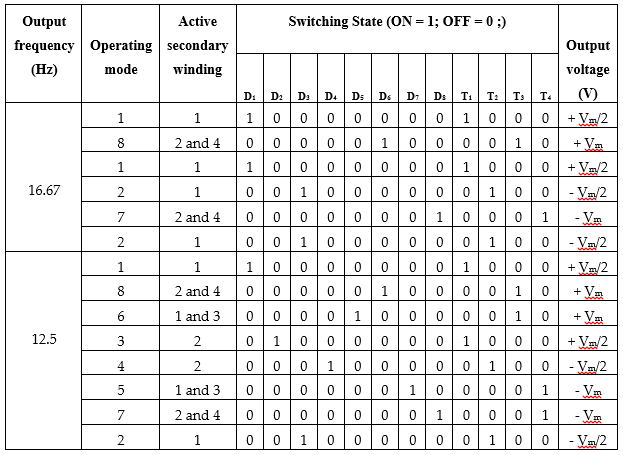

# Advanced AC/AC Power Converter

Single-phase to single-phase AC/AC Power Converter laboratory prototype hardware design and drive.

A new generalized step-down single-stage line-frequency switching AC/AC power converter topology is presented here. The converter uses line-frequency switching and does not require any pulse width modulation techniques. The  topology offers promising performances in terms of lower order harmonics, total harmonic distortion, elimination of DC-link capacitors and EMI filters, and switching losses.
The major contributions of this article are:	
        
      1. A new single-stage line-frequency switching AC/AC power converter is proposed;
      2. The proposed converter can be used to convert any frequency without changing the hardware circuit;
      3. The proposed topology does not require any high-frequency switching pulse width modulation technique.

### Circuit Diagram
The following figure shows the single-phase to single-phase AC/AC Power Converter circuit topology. It uses a multi-winding center tapped transformer, pre-rectified diodes and silicon controlled rectifiers (SCRs). The multi-winding transformer is used here to create different voltage level according to the desired frequency conversion with lower THD.

## Operating Principle
The operating principle of the AC/AC power converter topology is described here with the help of 3:1 (m=3) and 4:1 (m=4) frequency conversion. By connecting the multi-winding center tapped transformer with the AC voltage source, the input AC voltage is divided into small AC voltage levels in a different section of winding. Power diodes are used as a pre-rectifier, which rectifies both the positive cycle and the negative cycle for each section of winding. Hence, only one unidirectional switch is required for each winding to pass the corresponding positive cycle and the negative cycle. The odd numbering switches work as the positive converter, and the even numbering switches work as the negative converter. There are eight operating modes as shown in the following Figure, to describe the working principle of the 3:1 (m=3) and 4:1 (m=4) frequency conversion. The explanation of the eight operating modes helps to understand other frequency conversions also. 

## Switching states 
The following Table shows the switching states with corresponding frequency conversion. Table-1 shows the summarization of the individual output voltage level with the corresponding switching state. Table 1 clearly shows the entire operation of 3:1 (m=3) and 4:1 (m=4) frequency conversion of the AC/AC power converter.

The following figure shows the output voltage conversion with corresponding switching states.

## Conversion Process
The value of the AC voltage source is considered as 220 V, 50 Hz and a 1:4 multi-winding center tapped transformer is used. Figure (a) shows the secondary four winding transformer voltage waveforms. Connecting the full-wave pre-rectified diode, the ac voltage is rectified in each winding before the SCRs switches where the rectified voltage is shown in Figure (b). The switching pulses of the 3:1 (m=3) frequency conversion are shown in Figure (c). The converted output voltage of the proposed 3:1 (m=3) is presented in Figure (d).

Similarly, for 4:1 (m=4) frequency conversion of the proposed topology, the winding voltage and the rectified voltage is unchanged shown in Figure (a) and (b), respectively.
Here, the gate drive pulses are different, which is shown in Figure (c). The converted output voltage of the 4:1 frequency conversion is shown in Figure (d).

### Hardware Implementation
Half wave rectifier with 4n35 IC is used for zero-cross detection.  ZCD is used to synchronize the firing of SCRs with the input supply. Arduino Uno (ATmega328) processor board is used to generate the gate drive pulses, and MOC3021 opto-coupler IC is used to isolate the DC signal from the AC supply. TYN612 SCRs are used to control the phase of the sinusoid. 1N4007 diode is connected in series with the SCR. The following figure shows the PCB design of the AC/AC power converter.

### Software/Coding
To generate the gate driving pulse, Arduino uno board is used. The following pin's are used:

    1. INPUT: Digital pin-7
    2. OUTPUT: Digital pin-2, 3, 4, 5 (where 3 for T1, 2 for T3, 4 for T2 and 3 for T4 switch according to the designed circuit.)
Here, total two arduino files are uploaded for 17 hz and 12.5 hz frequency conversion. Just download the code and upload to your arduino uno board.

### Output Graph
The following figures show the output voltage of the single-phase to single-phase AC/AC Power Converter taking from a two channel digital oscilloscope.

The following figures show the gate driving pulses of the four switches of the single-phase to single-phase AC/AC Power Converter, taking from a two channel digital oscilloscope.

